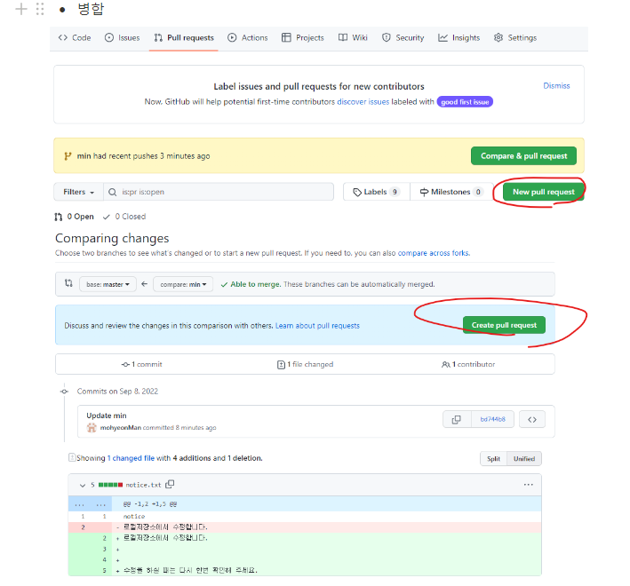
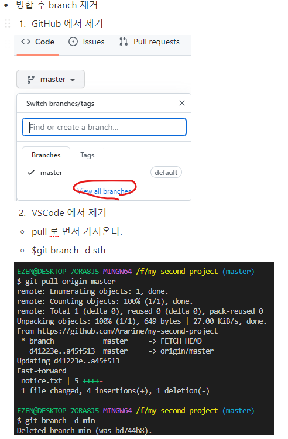
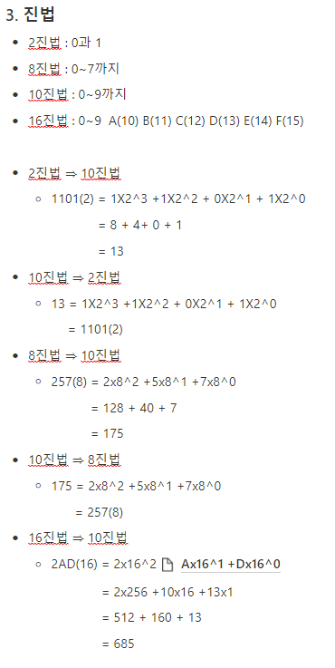
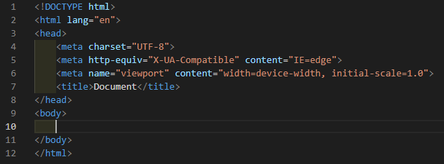
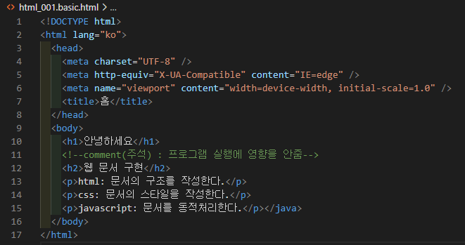

# TIL

## 리눅스 명령어

1. ls
   > list (목록)
2. cd
   change directory (작업 경로 변경)
3. rm

   remove (파일 삭제)

4. mkdir
   make directory(작업목록 생성)
5. rmdir

   remove directory(작업목록 삭제)

6. touch

   파일 생성

7. cat

   파일의 내용 출력

---

## Git

1. init

   git 생성

2. add <파일명>

   staging area(SA)로 이동

3. commit -m <메세지>

   Repository로 이동

4. push <원격저장소><브랜치>

   원격(GitHub)으로 이동

5. pull <원격저장소><브랜치>

   원격에서 Local로 이동 (수정파일만)

6. clone <원격저장소><브랜치>

   원격에서 Local로 복제

7. status

   Staging Area의 상태 (기세상태)

8. log

   Repository의 상태 (commit 상태)

9. git commit --amend

   바로 전 commit 과 Staging Area의 Merge을 할 때 사용

10. git restore --staged <파일명>

    Staging Area의 파일을 Working Directory로 가져옴

11. git branch <name>

'name' 에 해당하는 branch 를 생산한다. 12. git branch

생성된 branch 들을 확인한다. 13. git switch <name>

'name'의 해당하는 branch 로 이동한다.

- branch 에서 commit 을 하게 되면 GitHub 상에 master 가 아닌 branch 이름의 탭이 생긴다.

14. branch 병합

  15. git log --oneline

log 를 축약하여 보여준다. 16. git reset --hard <고유번호>

'고유번호' 에 해당하는 commit 으로 reset 한다.

---

## 프로그래밍 패러다임

1. 명령형 프로그래밍(How)

   a. 알고리즘을 명시하고 목표는 명시하지 않는다.  
    b. 프로그래밍의 상태와 상태 변경을 시키는 '구문'의 관점에서 연산을 설명하는 방식이다.  
    c. 절차적 프로그래밍, 객체지향 프로그래밍

2. 선언형 프로그래밍(What)

   a. 알고리즘을 명시하지 않고 목표만 명시한다.  
   b. 함수형 프로그래밍

---

## 프로그래밍 언어

- 프로그래밍 언어란 컴퓨터 프로그램을 작성하기 위한 언어이다.

  1. 절차적 프로그래밍  
     a. 순차적인 처리 방식으로 프로그램 전체가 유기적으로 연결되도록 하는 프로그램이다.  
     b. 처리되는 속도가 빠르나 유지보수가 어렵고 실행순서가 정해져 있으므로 코드의 순서가 바뀌면 동일한 결과를 보장하기 어렵다.
  2. 객체지향 프로그래밍  
     a. 실제 세계를 모델링하여 프로그램을 객체들의 모임으로 표현하는 프로그램이다.  
     b. 클래스를 이용해 연관있는 처리부분과(함수) 데이터부분(변수)을 하나의 객체로 묶어 객체를 생성해 문제를 해결한다.  
     c. 캡슐화, 상속, 다양성
  3. 함수형 프로그래밍  
     a. 순수함수를 보조함수와 조합하고 소프트웨어를 만드는 방식이다.  
     b. 로직내에 복합성을 해결하고 변수사용을 억제하여 상태변경을 피하려는 프로그래밍이다.  
     c. 일급객체, 고차함수, 불변성, 순수함수, 합성함수

     1. 인터프리터 언어  
        a. 원시코드를 기계어로 변환하는 과정없이 한줄씩 바로 명령어를 실행하는 언어이다.  
        b. Runtime 상황에서는 한 줄식 실시간으로 읽어서 실행하기 때문에 컴파일 언어에 비해 속도가 느리다.
        c. 실행속도는 느리지만 코드 변경시 빌드 과정없이 바로 실행이 가능하다는 장점이 있다.

     2. 컴파일러 언어  
        a. 컴파일 언어는 원시코드(프로그래머가 작성한 소스코드)를 모두 기계어로 변환한 후에 기계(JVM 같은 가상 머신)에 넣고 기계어 코드를 실행한다.
        b. 소스코드를 기계어로 번역하는 빌드 과정에서는 인터프리터 언어에 비해 시간이 소요된다. 하지만 런타임 상황에서는 이미 기계어로 모든 소스코드가 변환되어 있기 때문에 빠르게 실행할 수 있다.

---

- 문자코드

  - 문자와 숫자를 1:1로 매칭시켜 놓은 값이다.
  - 컴퓨터가 사용하는 0 과 1로 변환할 때 사용되는 기준

- 진법(진수)

  - 10(사람), 2(기계), 8, 16

- 인코딩(디코딩)
  - 이진법으로 나열된 것들을 방법에 따라 처리하는 방식

---

### 1. 문자코드

- ASCII코드(7비트), 확장ASCII코드(ANSI = 8비트), 유니코드, EUC-KR 등.
  - ANSI 로 저장을 할 경우 cp 값이 존재한다. (cp 값은 cmd 에서 'chcp'로 확인가능)
    - code page : 7비트를 제외한 나머지 한 자리를 채우기 위한 코드, 각 나라별로 상이(한국은 949)

### 2. 인코딩

- 유니코드(utf-8, uft-16, uft-32)
  - utf-8 : 가변
  - uft-16 : 고정, 2byte만 사용
- Bit : 0 과 1만 저장할 수 있는 단위
- Byte : 8 bit가 모여 1 byte가 된다.

### 3. 진법

---

# HTML

1. 어떤 언어로 사용할지 설정
2. 언어 설정
3. html 사이에는 head 와 body 만 들어가야한다.
4. <head></head> : 스타일 시트 설정
5. <!--내용--> : 주석 처리
   1. 페이지 소스 보기에서 내룔이 표시되므로 중요 내용이 아닌 내용을 구별하기 위해서 사용한다.

